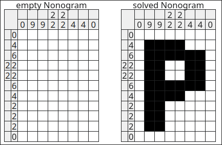

+++
title = "Let's make a nonagram solver!"
date = "2025-02-23T17:05:00-05:00"
author = "Greg Shiner"
authorTwitter = "" #do not include @
cover = ""
# tags = ["", ""]
# keywords = ["", ""]
description = "An exploration of puzzle solving and optimization"
showFullContent = false
readingTime = false
hideComments = false
color = "" #color from the theme settings
+++
# What's a Nonagram?
Nonagram is one of my favorite puzzles. It's a picture-based logic puzzle where you have a grid of squares that must be filled or left unfilled to create a picture according to some rules.
Each puzzle has a set of numbers to be used as "hints" that lead you to the solution to the puzzle.

The hints tell you the length and the order of the line segments that make up the corresponding row or column. So if a hint on a row is "2 4", that means that somewhere on that row there must be a span of 2 consecutive filled squares, then 4 consecutive filled squares, in that order. The segments must be seperated by at least 1 empty square. All squares start as blank and as the game progresses, you fill squares in as either filled or with an "x" to mark that it must be empty.

I've been solving these puzzles for many years now and I've always wondered how I would make an algorithm to solve them, and I finally decided that I was going to give it a solid stab as a bit of a challenge.
