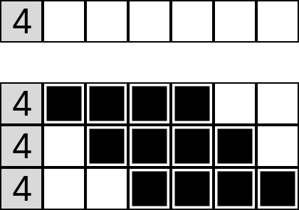
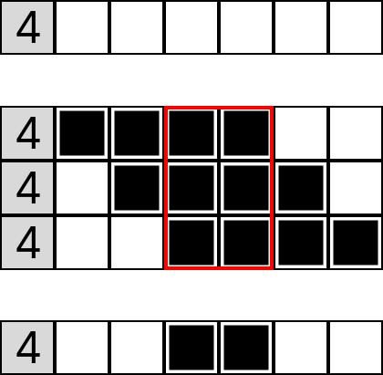
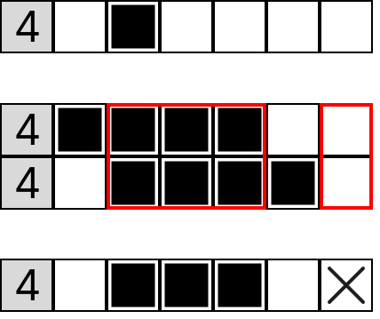

+++
title = "Let's make a nonagram solver!"
date = "2025-02-23T17:05:00-05:00"
author = "Greg Shiner"
authorTwitter = "" #do not include @
cover = ""
# tags = ["", ""]
# keywords = ["", ""]
description = "An exploration of puzzle solving and optimization"
showFullContent = false
readingTime = false
hideComments = false
color = "" #color from the theme settings
+++
# What's a Nonagram?
Nonagram is one of my favorite puzzles. It's a picture-based logic puzzle where you have a grid of squares that must be filled or left unfilled to create a picture according to some rules.
Each puzzle has a set of numbers to be used as "hints" that lead you to the solution to the puzzle.



The hints tell you the length and the order of the line segments that make up the corresponding row or column. So if a hint on a row is "2 4", that means that somewhere on that row there must be a span of 2 consecutive filled squares, then 4 consecutive filled squares, in that order. The segments must be seperated by at least 1 empty square. All squares start as blank and as the game progresses, you fill squares in as either filled or with an "x" to mark that it must be empty.
I've been solving these puzzles for many years now and I've always wondered how I would make an algorithm to solve them, and I finally decided that I was going to give it a solid stab as a bit of a challenge.

# Goals
This projects main techinical goal is of course to build an algorithm that is able to solve these puzzles, but let's add some to that.
1. Solve the puzzle
2. Solve puzzles of arbitrary size
3. Solve really, really big puzzles
4. Solve really, really big puzzles in a reasonable amount of time

Aside from the technical goals, the actual main goal of this project is to just learn. Learning by doing is absolutely the best way to hone any skill, and programming is by far no exception. This post will serve as a sort of dev log as I build and improve this project.

# Terminology
Before we get into the weeds of solving a problem, it's important to define the relevant terms.
1. Square/Cell: A single box on the puzzle grid
2. Line: Either an entire row or column of squares on the grid
3. Hint/Clue: The given values on either the side or top
4. Segment: A single number in a hint
<!-- TODO: add graphics -->

# How To Solve a Nonagram
The basic concept behind solving these puzzles is to repeatedly apply some rules to figure out what squares must or must not be filled in based on the hints and the current state of the game.
One observation we can make about this game is that *almost* (We will discuss the exceptions later) all puzzles can be solved just by repeatedly applying some logic to each individual row and column.
The simplest logic that can be used to do this is to first determine all of the possible valid states of a line.
These must be valid according to the clue and fit any constraints from the initial state of the line.
For example, if we have a clue of just 4, and an empty line of 6 squares, there are 3 possible solutions.

From here, we can see that the middle 2 squares of the line *must* be filled in because in all cases, those 2 squares are filled in. But in the outer squares, there are cases where they can be both empty and filled, so we have no definite information about them. In cases where we have no new information, we just keep the square blank.

So what happens when our initial line isnt't empty and has some squares already solved? In this scenario there may be fewer cases that are valid.

Two things of interest happen now in this case. The first is that there is only 2 possible placements of the line of 4. If we try to place the segment further to the right, the solution will no longer be valid, because there will be 5 squares in a row instead of 4. We also see though that in all solutions, the right-most square is empty. This means that there is no possible way for that square to be filled in, so we can mark it as empty with an X.

There are a lot more rules you can apply, but this general notion of finding the overlap in every possibile configuration of the line is enough to solve basically every puzzle. I highly encourage you to go try some of these puzzles on your own. Keep an eye out and see if you can come up with some more specific rules. If you want, the Wikipedia page has some great demonstrations of some more [Solution Techniques](https://en.wikipedia.org/wiki/Nonogram#Solution_techniques).

We've made a few observations so far, so let's start writting them down to for when we go make the algorithm.
1. Information can be extracted for a given line only using the current state of the line and its hint. It does not depend on the states of other lines.

