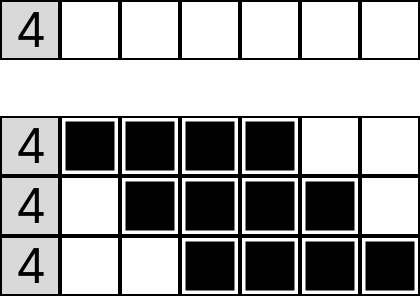
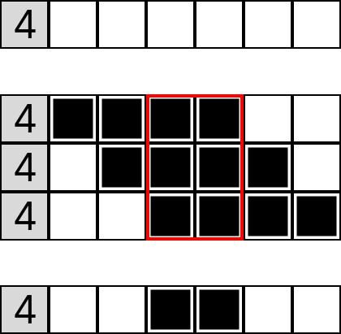
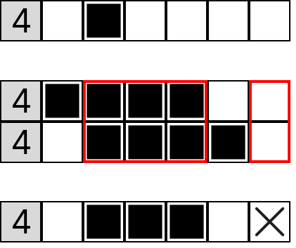
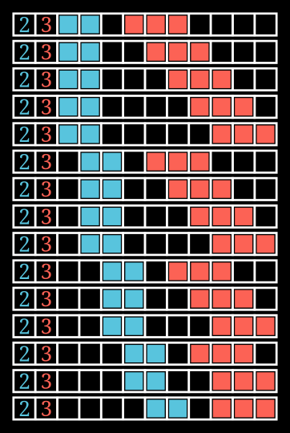
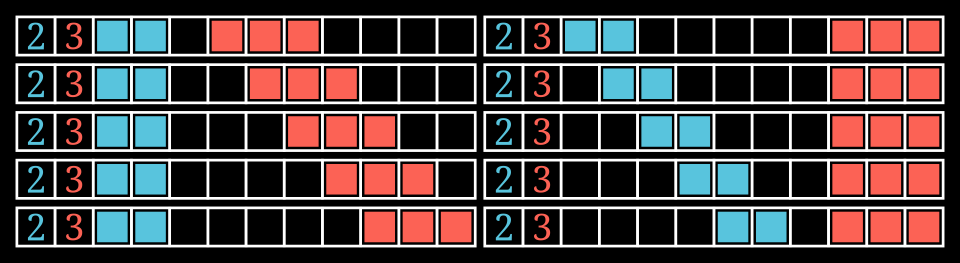
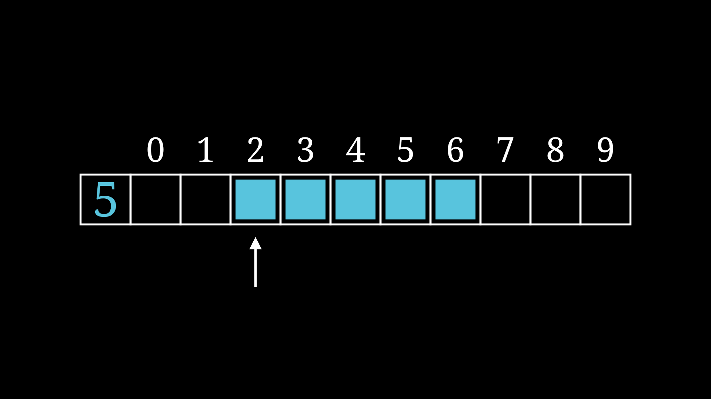

+++
title = "Let's make a nonagram solver!"
date = "2025-02-23T17:05:00-05:00"
author = "Greg Shiner"
authorTwitter = "" #do not include @
cover = ""
# tags = ["", ""]
# keywords = ["", ""]
description = "An exploration of puzzle solving and optimization"
showFullContent = false
readingTime = false
hideComments = false
color = "" #color from the theme settings
+++
# What's a Nonagram?
Nonagram is one of my favorite puzzles. It's a picture-based logic puzzle where you have a grid of squares that must be filled or left unfilled to create a picture according to some rules.
Each puzzle has a set of numbers to be used as "hints" that lead you to the solution to the puzzle.



The hints tell you the length and the order of the line segments that make up the corresponding row or column.
So if a hint on a row is "2 4", that means that somewhere on that row there must be a span of 2 consecutive filled squares, then 4 consecutive filled squares, in that order.
The segments must be separated by at least 1 empty square.
All squares start as blank and as the game progresses, you fill squares in as either filled or with an "x" to mark that it must be empty.
I've been solving these puzzles for many years now, and I've always wondered how I would make an algorithm to solve them, and I finally decided that I was going to give it a solid stab as a bit of a challenge.

# Goals
This projects main technical goal is of course to build an algorithm that is able to solve these puzzles, but let's add some to that.
1. Solve the puzzle
2. Solve puzzles of arbitrary size
3. Solve really, really big puzzles
4. Solve really, really big puzzles in a reasonable amount of time

Aside from the technical goals, the actual main goal of this project is to just learn. Learning by doing is absolutely the best way to hone any skill, and programming is by far no exception. This post will serve as a sort of dev log as I build and improve this project.

# Terminology
Before we get into the weeds of solving a problem, it's important to define the relevant terms. Here's a few that will appear througout this project.
1. Square/Cell: A single box on the puzzle grid
2. Line: Either an entire row or column of squares on the grid
3. Hint/Clue: The given values on either the side or top
4. Segment: A single number in a hint
<!-- TODO: add graphics -->

# A super basic solution
The basic concept behind solving these puzzles is to repeatedly apply some rules to figure out what squares must or must not be filled in based on the hints and the current state of the game.
One observation we can make about this game is that *almost* (We will discuss the exceptions later) all puzzles can be solved just by repeatedly applying some logic to each individual row and column.
The simplest logic that can be used for this is to first determine all the possible valid states of a line.
These must be valid according to the clue and fit any constraints from the initial state of the line.
For example, if we have a clue of just 4, and an empty line of 6 squares, there are 3 possible solutions.

From here, we can see that the middle 2 squares of the line *must* be filled in because in all cases, those 2 squares are filled in. But in the outer squares, there are cases where they can be both empty and filled, so we have no definite information about them. In cases where we have no new information, we just keep the square blank.

So, what happens when our initial line isn't empty and has some squares already solved? In this scenario there may be fewer cases that are valid.

Two things of interest happen now in this case.
The first is that there is only 2 possible placements of the line of 4.
If we try to place the segment further to the right, the solution will no longer be valid, because there will be 5 squares in a row instead of 4.
We also see though that in all solutions, the right-most square is empty.
This means that there is no possible way for that square to be filled in, so we can mark it as empty with an X.

Now to solve a full puzzle, you simply apply this process to each row and column and repeat until it's (most likely) solved.
There are a lot more rules you can apply, but this general notion of finding the overlap in every possible configuration of the line is enough to solve basically every puzzle. I highly encourage you to go try some of these puzzles on your own. Keep an eye out and see if you can come up with some more specific rules. If you want, the Wikipedia page has some great demonstrations of some more [Solution Techniques](https://en.wikipedia.org/wiki/Nonogram#Solution_techniques).
For now though, let's identify two critical observations:
1. Information can be extracted for a given line only using the current state of the line and its hint. It does not depend on the states of other lines.
  a. This process will be called "refining a line"
2. A puzzle can be solved by refining each row and column repeatedly.

# We can do better
As you can imagine, the process of finding every possible solution of a line is quite slow. So how can we do better?
Even with a simple line with the clue (2, 3) and an empty line with a length of 10, we would have to compute 15 different permutations.

If what we are after is the overlap between every solution, maybe there is some way to get the overlap without actually calculating every solution.
Let's for a moment change our goal. Instead of looking for the overlap between *every* solution, let's look at just the overlap between *each segment*.
When we restrict our line refinement to this new condition, we can simplify how we calculate the overlap.
Now instead of calculating every possible solution of the line, we only have to find the possible positions of each segment.

In this case specifically, we went from 15 positions to calculate, down to 10.
In reality, the original method had the worst case growth of the product of the numbers of positions of each segment, (in reality, it would never hit this number because a lot of these permutations will be invalid) whereas now, we have reduced it to the sum.

Let's take a look at what it would look like to refine a line with this new strategy. We will start with an empty line and place all the segments as far left as possible. Then we will duplicate this line below it. We're going to move around the segments on this line, so we will also track the overlap between the individual segments between the lines. As the segments slide to the right across their possible positions, watch how the overlap shrinks to its refined form.

Note that we can only look at the overlap between the individual segments instead of the general overlap between the lines.
In this case here, the point in the middle where the red segment on the left solution overlaps with the blue segment on the right solution, we leave the cell blank.
This is despite the fact that both the left and right solutions have that square filled in.
This is because there are still many permutations of the line that have that space empty.
Looking only at the overlap between the individual segments prevents this issue.

Now notice that the line on the top is the left-most solution, meaning every segment is placed as far left as possible.
As we slide the segments to the right as far as they can go, we end up with the right-most solution.
This means that we don't even need to calculate each possible position of each segment.
We only need to find the left and right-most solutions to refine our line.
Let's see what an algorithm might look like that just looks at these extremes.



This is an algorithm based on the [Simple Boxes](https://en.wikipedia.org/wiki/Nonogram#Simple_boxes) and [Simple Spaces](https://en.wikipedia.org/wiki/Nonogram#Simple_spaces) methods.
It takes the concepts from those algorithms and generalizes them to all possible states of a line, not just the beginning of the puzzle.
At a high level, the algorithm looks like this:
1. Find the left-most solution to a line (all segments placed as far left as possible)
2. Find the right-most solution to a line (all segments placed as far right as possible)
3. Any overlap between the same segment on both solutions must be filled.
4. Any gap in between the same 2 segments on both solutions must be empty.

Let's take a look at another example showing some x's by having a non-empty initial state.



Now we can see that if we have some initial state on the line, the valid solutions are more limited. This can sometimes cause there to be no state where some squares are filled in. In this case, we mark it with an x. In this case, both segments only have 2 valid positions each. So once again we take the overlap between the matching segments and mark them as filled. But we can also mark the overlapping x's in the gap between the 2 segments. Note that we do have to apply a similar rule that only gaps between the same 2 segments can be marked as x's.

<!-- TODO: Find a good example of this rule and animate it -->

# Almost there
This is a good point to take a moment and recap what our algorithm looks like so far.
1. Pick a row or column
2. Find the left-most solution
3. Find the right-most solution
4. Mark any overlap between the 2 same segments as filled
5. Mark any gap between the 2 same segments as an x
6. Repeat for every row and column until the puzzle is solved

It seems simple enough so far, but how do we even compute the left and right most solutions?
As humans, this seems like a pretty simple task, but an algorithm that can do this that works in all cases is not as simple as it seems.
To come up with this algorithm, let's try and reduce our requirements and see if we can glean some insights.
First, we can observe that we only need 1 algorithm for both the left and right most solutions.
If we only come up with one for the left-most solution, we can reuse it for the right-most solution.
To do this, simply reverse the line and the hint, find the left-most solution of the flipped line, then reverse it back. 

Now let's just look at the case of having an empty initial line.
This is what the case will likely be at the start of the puzzle when there's little already established information about individual cells.
When we're talking about how a segment should be placed on a line, it would be useful to have a convention to describe where on a line a segment is being placed.
Since we will be using an array of squares to represent a line, it would be useful to represent this placement as an index into the array.
Let's define that when we say "this segment is at position *i*" we mean that the first, or left-most square, in the segment is placed at index i in the array, and it extends for its length to the right.
For example this is what it would look like if we were to say that the segment is placed at position, or index, 2.


To come up with the left most solution of an empty line, we can use the following python code:
```python
from enum import Enum
from typing import List
# Represents the state of an individual square
# An enum type can be one of any of the variants defined
class SquareState(Enum):
    UNKOWN = 0 # Blank cell with an unknown state
    FILLED = 1 # Marked cell that must be filled
    EMPTY = 2  # Marked cell that must NOT be filled (x)

# A segment length in a hint
type Segment = int

# This function takes as input a hint and the initial state of a line
# Returns the left most solution of the line
def find_left_sol(hint: List[Segment], line: List[SquareState]) -> List[SquareState]:
    next_seg_pos = 0 # Tracks where the next segment must be placed
    for segment in hint:
        for i in range(next_seg_pos, next_seg_pos + segment): # for each position from the start pos to the end position
            line[i] = SquareState.FILLED # Set the state to FILLED
        next_seg_pos += segment + 1 # Adjust start position for next segment to be after the end of the current segment + 1 for the gap

    return line
```



<!-- I'm not terribly happy w this section -->

While this algorithm is quite simple, it's quite inflexible and won't work in many cases except for the initial blank line.
It's important for the line solver to take into account the initial state of the line since the other lines that cross a given line may change the state of the line.
So we need to come up with a way to place the segments as far left as possible, *that accounts for the initial state of the line.*

A specific case where this approach will break is if there is already an x on the line. It may try to place a segment on top of the x
One simple way we can fix this is to check if the placement of a segment is valid before we place it. If it is, place it down, if not shift it over to the right by 1 and try again.



In this example, there is an x in the 4th square initially. So when the algorithm goes to place the green segment, it shifts it to the right until it is clear of the x.

Now that we have a way of accounting for x's that are on the initial line, we need to account for the case of there being filled in squares on the initial line.
This one is quite a lot trickier though. There are a lot of weird cases that can happen here, whereas with the x's its just simply "don't place a segment on top of an x."
For example, there may not be a way to determine which segment a specific filled in square belongs to in the final solution.
<!-- Maybe add an example -->
Let's take a step back and see if we can find some patterns that emerge. What if we try changing how we think of the set of valid solutions?
Previously, we just thought of them as a simple set or list of every valid permutation of the segments.
What if instead, we tried thinking of this set as a tree?
The root node will be the initial line. Each child of every node will be a different valid placement of the next segment.

The algorithm I came up with to solve this problem is actually recursive. Although I'm sure there's a way to do it without recursion, this is the way that made the most sense to *me* so I stuck with it.
This algorithm once again builds on top of the previous one but does some checking to see if a given placement of a segment causes itself or later placements to be invalid.
